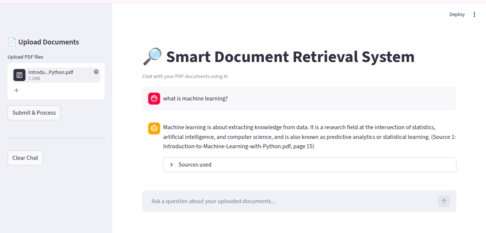

# Smart Document Retrieval System

A Streamlit-based AI application that allows users to upload PDF files, ask questions about their content, and receive answers based on the uploaded documents.

The system extracts text from PDFs, splits the content into chunks, creates embeddings, stores them in a FAISS vector index, retrieves the most relevant chunks, and uses Gemini to generate an answer with the sources used.

## App Preview




## Features

- Upload one or multiple PDF files
- Ask questions about uploaded documents
- Extract text from PDF pages
- Split documents into smaller chunks
- Generate local CPU embeddings
- Store embeddings using FAISS
- Retrieve relevant document chunks
- Generate answers using Gemini
- Show sources used for each answer

## Tech Stack

- Python
- Streamlit
- LangChain
- FAISS
- Google Gemini
- HuggingFace Sentence Transformers
- pypdf
- python-dotenv

## Models Used

### Generation Model

```text
models/gemini-2.5-flash
```

Used to generate the final answer based on the retrieved document context.

### Embedding Model

```text
sentence-transformers/all-MiniLM-L6-v2
```

Used locally on CPU to convert document chunks into embeddings.

## How It Works

```text
PDF Upload
    ↓
Text Extraction
    ↓
Chunking
    ↓
Embedding Generation
    ↓
FAISS Vector Store
    ↓
User Question
    ↓
Relevant Chunk Retrieval
    ↓
Gemini Answer Generation
    ↓
Answer + Sources
```

## Installation

### 1. Clone the repository

```bash
git clone https://github.com/your-username/Information-Retrieval-System.git
cd Information-Retrieval-System
```

### 2. Create a virtual environment

Using Conda:

```bash
conda create -n rag python=3.10 -y
conda activate rag
```

Or using venv:

```bash
python -m venv venv
source venv/bin/activate
```

On Windows:

```bash
venv\Scripts\activate
```

### 3. Install dependencies

```bash
pip install -r requirements.txt
```

## API Key Setup

This project requires a Google Gemini API key.

Create a file named `.env` in the root directory:

```text
Information-Retrieval-System/.env
```

Add your API key inside it:

```env
GOOGLE_API_KEY="your_google_api_key_here"
```


## Running the App

Start the Streamlit app:

```bash
streamlit run app.py
```

Then open the local URL shown in the terminal, usually:

```text
http://localhost:8501
```

## How to Use

1. Open the app in your browser.
2. Upload one or more PDF files.
3. Click `Submit & Process`.
4. Wait until processing is complete.
5. Ask a question about the uploaded documents.
6. Open `Sources used` to see the document chunks used to generate the answer.

## Notes

- The first run may take longer because the embedding model is downloaded.


## Future Improvements

- Save and reload FAISS indexes
- Add chat memory
- Add OCR support for scanned PDFs
- Add support for DOCX and TXT files
- Add hybrid search
- Deploy the app online